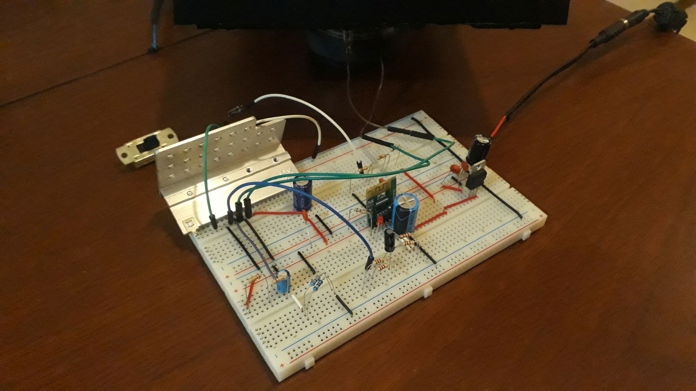
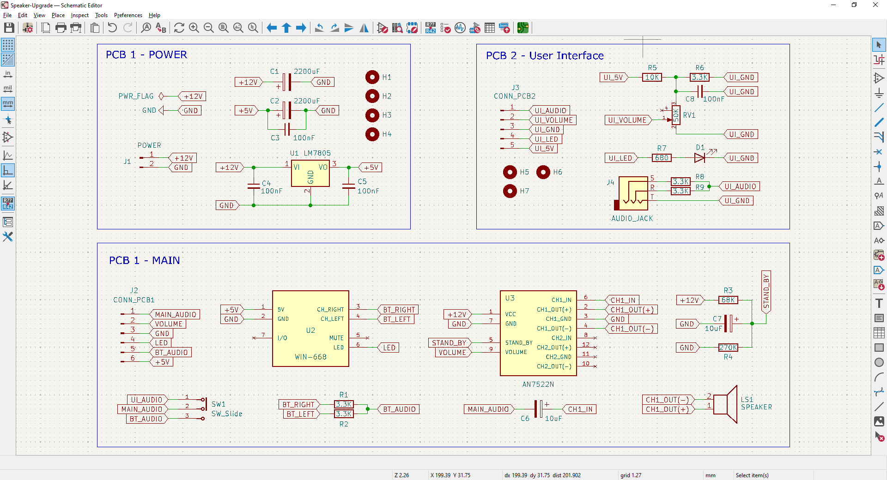
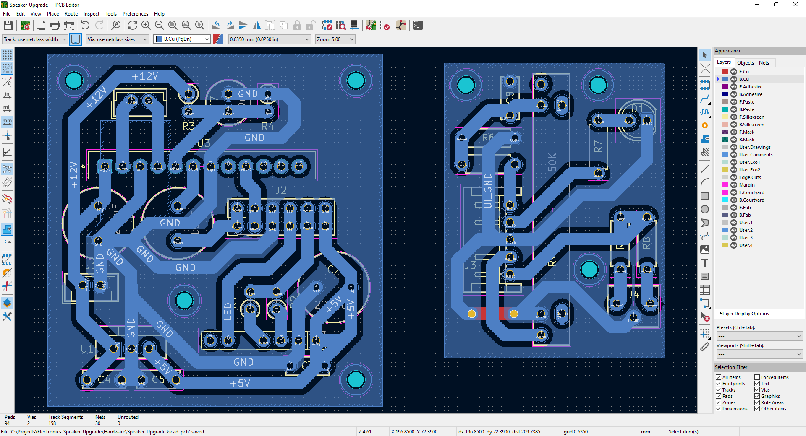
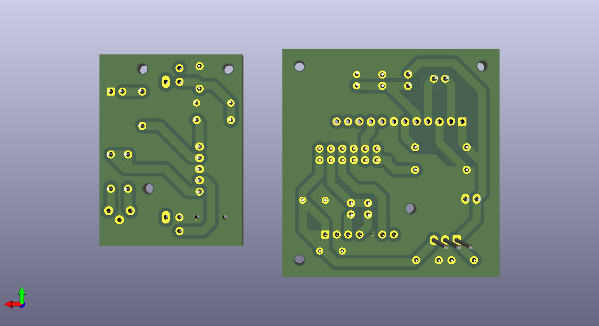

# Speaker Upgrade

Speaker modernization (50 watts, 6 ohm) to function as a semi-portable, independent device, separate from the original audio system.

The following features are added:
- Bluetooth audio reception.
- AUX input with a 3.5mm jack for wired connection.
- Slider potentiometer for volume control.
- DC connector for 12V power supply.
- On/off switch button.

This project is a **work-in-progress**.

&nbsp;

### Notes:

- Power input: 12 VDC
- 2 PCBs are included:
  - Main PCB: for power, BT and audio amplifier features.
  - Auxiliar PCB (for UX): volume slider, LED and AUX audio jack.

&nbsp;

### List of Materials

- 1 x Speaker 10+ watts, 6 ohms
- 1 x Audio Amplifier AN7522N 5W+5W + Heat Sink
- 1 x BT receiver WIN-668 module
- 1 x Lineal Regulator TP7805 + Heat Sink
- 1 x Capacitor 2200uf (electrolitic)
- 1 x Capacitor 1000uf (electrolitic)
- 1 x Capacitor 470uf (electrolitic)
- 1 x Capacitor 10uf (electrolitic)
- 4 x Capacitor 100nf (ceramic)
- 1 x Potentiometer 50K (slider)
- 1 x Resistor 1M ohms
- 1 x Resistor 330K ohms
- 1 x Resistor 47K ohms
- 2 x Resistor 22K ohms
- 2 x Resistor 10K ohms
- 4 x Resistor 3.3K ohms
- 1 x Resistor 680 ohms
- 1 x LED 5mm
- 1 x Audio jack 3.5mm
- 1 x Switch button (audio source)
- 1 x Rocker button (power on/off)
- 1 x DC Jack (power)
- 1 x JST 2-pins connector (or similar)
- 1 x JST 5-pins connector (or similar)
- 1 x JST 6-pins connector (or similar)
- Wires

&nbsp;

### Screenshots

| Breadboard                                           | Assembly                                             |
|------------------------------------------------------|------------------------------------------------------|
|                   |                    |

| Assembly                                             | Assembly                                             |
|------------------------------------------------------|------------------------------------------------------|
|                    |                    |

| Schematics Diagram                                   | PCB Diagram                                          |
|------------------------------------------------------|------------------------------------------------------|
|              |                     |

| PCB Render 3D                                        | PCB Render 3D                                        |
|------------------------------------------------------|------------------------------------------------------|
|              |            |

| Project Final                                        | Project Final                                        |
|------------------------------------------------------|------------------------------------------------------|
|                    |                    |

See 'Resources' folder for more pictures & videos of the project.

&nbsp;

### Version History

v1.0 (2026.02.15) - Adding base schematics and PCB.  
v1.1 (2026.02.16) - Improvements on schematics and PCB.  

&nbsp;

This source code is licensed under GPL v3.0  
Please send me your feedback about this project: andres.garcia.alves@gmail.com
